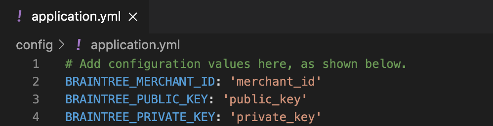
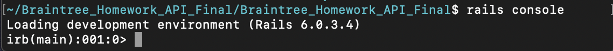
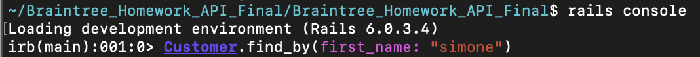
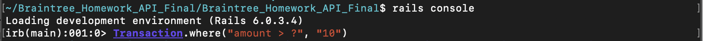
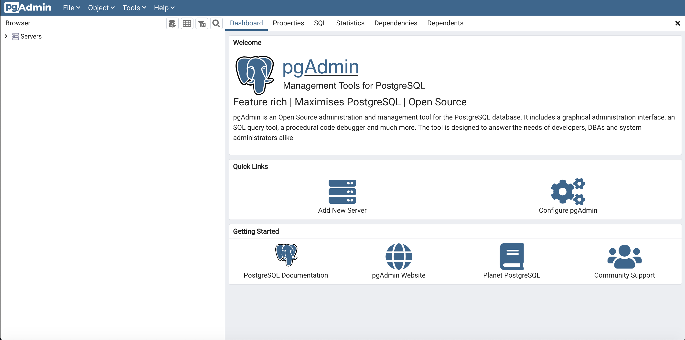
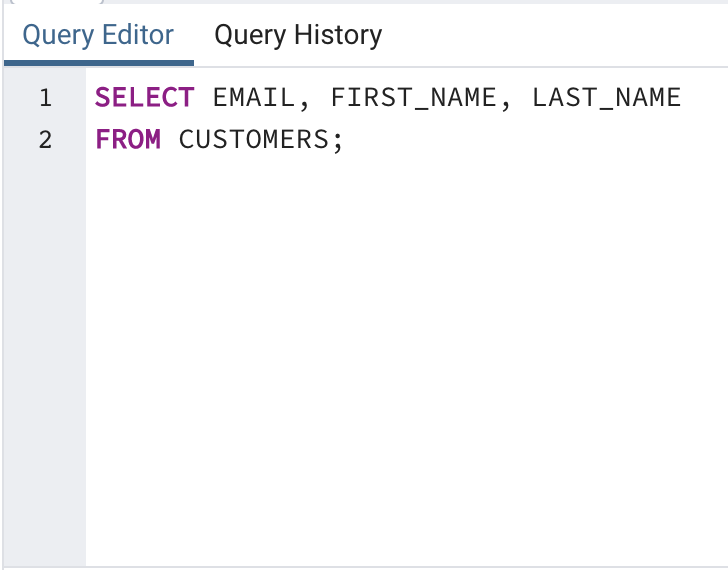
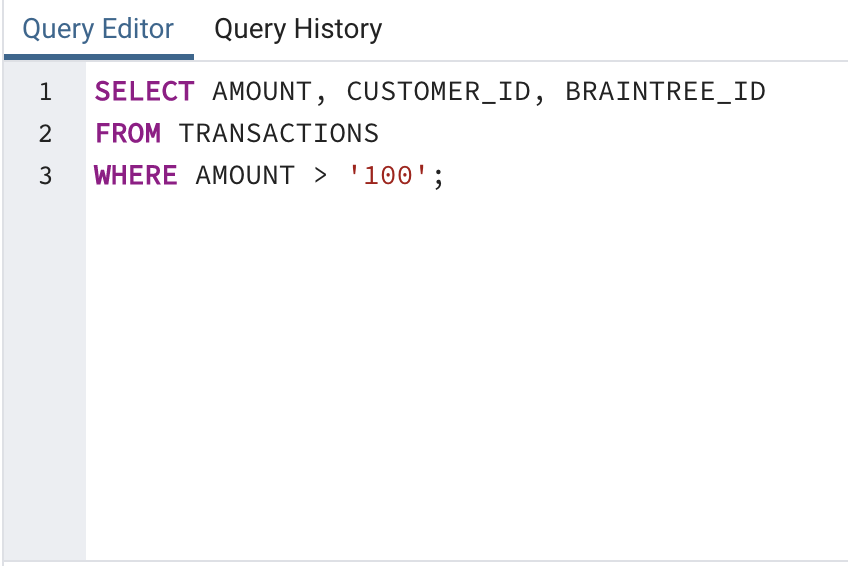

# API Support Internal Code Challenge (11/2020)

The Branitree Hosted Fields Integration outlined throughout this documentation is my candidate take home assignment for Braintree's API Support team. It is two-parts with the first being a general Hosted Fields Integration built alongside instructions (included) from the hiring team. The second is a PostgreSQL database also built according to instructions (included) provided by the hiring team. 

## Architecture
---
#### Technical Stack/Framework Used
* [Fullstack Ruby on Rails](https://guides.rubyonrails.org/v5.0/getting_started.html) 
* [PostgreSQL (Database)](https://postgresapp.com/)
* [Braintree API](https://www.braintreepayments.com/sandbox)
  * Ruby SDK (Server-Side)
  * Javascript SDK (Client-Side)
#### Languages
* [Ruby](https://www.ruby-lang.org/en/documentation/installation/)
* [SQL](https://postgresapp.com/)
* Javascript
* HTML
* CSS

## API Reference Documentation
---
[Braintree's Set Up Your Server for Ruby SDK](https://developers.braintreepayments.com/start/hello-server/ruby)

[Braintree's Client SDK for JavaScript v3 SDK](https://developers.braintreepayments.com/guides/client-sdk/setup/javascript/v3)

[Braintree's Hosted Fields Setup and Integration](https://developers.braintreepayments.com/guides/hosted-fields/setup-and-integration/javascript/v3)

[Braintree's Hosted Fields Reference GitHub Documentation](https://braintree.github.io/braintree-web/current/HostedFields.html)

[Braintree's Transaction.sale() for Ruby SDK](https://developers.braintreepayments.com/reference/request/transaction/sale/ruby)

[Braintree's PaymentMethodNonce.create() for RubySDK](https://developers.braintreepayments.com/reference/request/payment-method-nonce/create/ruby)

[Braintree's Customer.create() for Ruby SDK](https://developers.braintreepayments.com/reference/request/customer/create/ruby)

---
 

## Project Setup
---
 
Note: It is important that you have the frameworks and languages associated with this project installed on your machine before proceeding. I have included links to each one under the **Architecture** heading to assist with this. 

0. If you haven't already, head over to Braintree and sign up for a [free sandbox account](https://www.braintreepayments.com/sandbox). After signing up, login and locate your important gateway credentials; Merchant ID, Private Key, and Public Key (review the Braintree support article entitled  [Important Gateway Credentials](https://articles.braintreepayments.com/control-panel/important-gateway-credentials) for assistance with this). Keep these values accessible throughout the  project setup and integration testing as they will be needed.
1. Save the project zip file to your machine and navigate to the project's directory within your terminal.
2. Once in the project's directory, run the command   
>`bundle install` 
3. After all of the ruby gem files have successfully loaded as indicated by your terminal, run the command  
>`rails db:setup`
4. This command establishes the database for the project on your machine. Once it is established, open the project within your text editor. 
5. Now we need to set the environment. From your text editor create a **application.yml** within the config folder (app>config) of the project hiearchy.  Input the corresponding unique gateway credentials associated with your Braintree Sandbox as illustrated below. (see Step 0 for assistance with locating these values)

5. Return to the project's directory within your terminal and run the command   
>`rails server` 
6. The project should be loading on your localhost server as indicated by terminal activity and you should now be able to see the project in your browser as pictured above.

 

## Integration Project: Part 1
---

>Objective: 
>Your integration should make use of our ​JavaScript v3 SDK Hosted Fields​ solution and any of our server-side languages available on our ​API documentation page​. Hosted Fields is a little different than the Drop-In UI solution described in the ​Getting Started guide​, but many of the basic concepts are the same. 

>Your client-side code needs to:
>1. Request a from your server
>2. Perform a
request to configure Hosted Fields. You’ll
 ​client_token​
  ​braintree.hostedFields.create​
 need to use the client token
>3. Present a payment form​ that uses Hosted Fields
>4. Upon submission, your form should submit a ​payment method nonce​ to your server to
create a transaction
>5. Inform your end user of whether or not the transaction in step 4 was successful

>Your server-side code needs to:
>1. Generate a ​client_token​ in response to your client-side request
>2. Make an API request to use the ​payment_method_nonce​ to ​verify a card​ and ​store it in
your Vault
>3. Make a subsequent API request using the result object from Step 2 to ​create a
transaction​ using this stored payment method token

>Your integration should appropriately handle client-side and server-side errors and present the
>relevant information for any errors to your end users.

 

### Overview
---

This portion of the project requires no additional installation steps. After following the steps listed in the project setup section, you should be able to perform tests via the application in your browser.  

### Testing
---
In order to test this integration against the various contraints listed above (or ones you come up with), it is recommended that you use [Braintree's test credit card values](https://developers.braintreepayments.com/guides/credit-cards/testing-go-live/ruby) in creating transactions. You can create customers using any criteria as long as the following are provided:
* First Name
* Last Name
* Email 
* Phone Number (must be a numerical value)

Transactions can be searched within your Braintree Sandbox using the **Transactions** button (shown below) located on the Control Panel's navigation bar. Clicking this button will yield a search panel. This [search panel within the Control Panel](https://articles.braintreepayments.com/control-panel/search) allows you to query transactions and customers that you create from testing. 

You can also search customers and verifications in the same way using the **Vault** button also located on the Control Panel's navigation bar.

### Credits
---
[Reddit Article "How I got the Braintree Payments SDK to work...Posted byu/-Zhytomyr-3 years ago"](https://www.reddit.com/r/laravel/comments/5tk6g6/how_i_got_the_braintree_payments_sdk_to_work/) 

[Using Braintree hosted fields with Ruby on Rails](https://brobertsaz.github.io/2017/rails-with-braintree-hosted-fields/)

[Form Validations with HTML5 and modern Rails](https://www.jorgemanrubia.com/2019/02/16/form-validations-with-html5-and-modern-rails/)

 

## Integration Project: Part 2
---
>Objective: Option One 

>​The goal is to create a SQL database that will accept ​customer information and ​transaction information​. Please provide 2 recommendations for queries we can run to access the data.

>Instructions:
>1. Add a SQL database to your integration. As a note, your database does not need to be persistent. We will run transactions through your integration before accessing the database, that said if there are any specific steps you’d like us to take to seed the database, please do include instructions.
>2. Any transactions and customers created should be added to the database
>3. Include instructions for where queries can be made to access transaction and
customer information from the database      
>4. Include 2 SQL queries that can be run to access specific data within the database

### Overview 
---
This integration is designed to store the transaction and customer information created during part one testing within a PostgreSQL database. I have provided steps below on seeding the database as well as executable queries using your terminal or pgAdmin (a database visualization tool). 
 
### Schema
---
This schema outlines the database's rows, columns, and tables using pre-created data found in the **seeds.rb** file. It also gives an idea of how and what data will be saved in it from testing conducted during Part One. 

 

**_Customers_**
| first_name      | last_name | email             | phone            |
| ----------- | ----------- | ----------- | ----------- |
| Simone      | deBeauvoir       |     simonedebeauvoir@hey.com        |      0033140000000      |
| Albert  | Camus        |    albertcamus@hey.com         |     21321305434        |
| Soren         |  Kierkegaard            |   sorenkierkegaard@hey.com          |        40854171     |
|   Frantz           |     Fanon             |          frantzfranon@hey.com        |     596700555822           |
|     Friedrich              |     Nietzsche              |        friedrichnietzsche@hey.com             |        5417543010            |
|                   |                      |                     |                    |

 

**_Transactions_**
| braintree_id      | amount | status             | customer_id            |
| ----------- | ----------- | ----------- | ----------- |
| null      | 100       |      Settled       |       1      |
| null   | 200        |     Settled        |         2    |
| null   | 300        |     Settled        |         3    |
| null   | 400        |     Settled        |         4    |
| null   | 500        |     Settled        |         5    |
| null   | 600        |     Settled        |         6    |

 

### Seeding the Database
--- 

While the testing completed in Part One results in customer and transaction information being stored in this database, you are not expected to seed the database from testing alone. I have included a file, **seeds.rb** (db>seeds.rb), that should be used instead to seed the database. Use the following instructions to do so.

0. Navigate to the project directory within your terminal.
1. Once inside the directory run the command 
>`rails db:seed`
2. Rails is not expressive after this command. It simply moves the cursor in preparation for another command. This means we're ready to query the database. 

 

### Installation: pgAdmin
---

Note: If you plan to query the databse using your terminal feel free to move on to the _Terminal_ section underneath the _Queries + Testing_ heading. Otherwise, use these instructions to install pgAdmin. In order to use pgAdmin you will need PostgreSQL already installed and running. 

0. Visit the pgAdmin site's page for macOS downloads at _https://www.pgadmin.org/download/pgadmin-4-macos/.
1. Select the latest version and download the installer (look for a Disk Image file that ends in .dmg).
2. Double-click the .dmg file, click through the prompt to accept the terms, and then drag pgAdmin's elepgant app icon into your _Applications_ folder. 
3. Double-click the app icon to launch pgAdmin.

_On macOS, when you launch pgAdmin the first time, a dialog might appear that displays "pgAdmin4.app can't be opened because it is from an unidentified developer." Right-click the icon and select **Open**. The next dialog should give you the option to open the app; going forward, your Mac will remember you've granted this permission._

Installation on macOS is relatively simple, but if you encounter any issues, review the documentation for Postgres.app at _https://postgresapp.com/_ and for pgAdmin at _https://wwww.pgadmin.org/docs/_. 

 

### Queries + Testing
___

This section provides instructions for querying the databse depending on whether you have chosen to use the terminal or pgAdmin. The SQL queries are not interchangeable between the two interfaces, meaning that those meant for pgAdmin are not to be used for the terminal and vice versa. 

 

#### **Terminal**
---

0. Navigate to the project's directory within your terminal. 
1. Input the command

>`rails console`

This will convert the terminal into the environment we will be able to run our queries through as pictured below. 

 

2. Feel free to input any one of the queries I have provided below, one for Customer and the other for Transaction.
3. Once each query successfully returns its results, the environment is ready for an additional query.  

 

_Customer_

This query returns the row within the Customer table associated with the first_name column for **_simone_**.

>`Customer.find_by(first_name: "simone")` 

_Transaction_

This query returns the Amount column within the Transaction table for **_all values greater than 10_** (note: this data object is a string).

>`Transaction.where("amount > ?", "10")`

 

#### **pgAdmin**
---

0. Open pgAdmin in your browser. The opening screen should look like the image below.

The left vertifcal pane displays an object browser where you can view available servers, databases, users and other objects. Across the top of the screen is a collection of menu items, and below those are tabs to display various aspects of database objects and performance. 

1. In the object browser expand the plus (+) to the left of the Servers node to show the default server. Depending on your operating system, the default server name could be _localhost_ or _PostgreSQL x_, where x is the version number.
2. Double-click the server name. Enter the password you chose during installation if prompted. A brief message appears while pgAdmin is establishing a connection. When you're connected, several new object items sholuld display under the server name. 
3. Expand _Databases_ and then expand the default database postgres.  
 

##### Running Queries using pgAdmin
---

1. Run PostgreSQL. On macOS, you must double-click Postgres.app in your applications folder.
2. Launch pgAdmin. In the left vertical pane (the object browser) expand the plus sign to the left of the Servers node to show the default server. Depending on how you installed PostgreSQL, the default server may be named localhost or PostgreSQL x, where x is the version of the application.
3. Double-click the server name. If you supplied a password during installation, enter it at the prompt. You'll see a brief message that pgAdmin is establishing a connection.
4. In pgAdmin's object browser, expand **Databases** to confirm that the **Braintree_Homework_API_Final** test and development databases exist within the hiearchy.(If it does not, use the _Troubleshooting_ portion of this document to help.) 
5. Open the Query tool by choosing **Tools > Query Tool**. 
6. In the SQL Editor pane (the top horizontal pane), feel free to type one of the queries shared below for customer or transaction.
7. Click the play icon to execute the statement. In the Output pane in the Query Tool under Messages you'll see a notice indicating that the query returned successfully alongside its results. 

 

_Customer_

This query returns the all rows within the Customer table associated with the first_name, last_name, and email columns.

_Transaction_

This query returns the Amount column within the Transaction table for **_all values greater than 100_** (note: this data object is a string).

 

### Credits
---
DeBarros, A. "Chapter 4: Importing and Exporting Data." *Practical SQL: A Beginner's Guide to Storytelling With Data,* Edited by No Startch Press. San Francisco. 2018, pp.24-37.   

DeBarros, A. "Chapter 6: Joining Tables in a Relational Database." *Practical SQL: A Beginner's Guide to Storytelling With Data,* Edited by No Startch Press. San Francisco. 2018, pp.73-91.   

DeBarros, A. "Chapter 7: Table Design that Works for You." *Practical SQL: A Beginner's Guide to Storytelling With Data,* Edited by No Startch Press. San Francisco. 2018, pp.93-112.   

