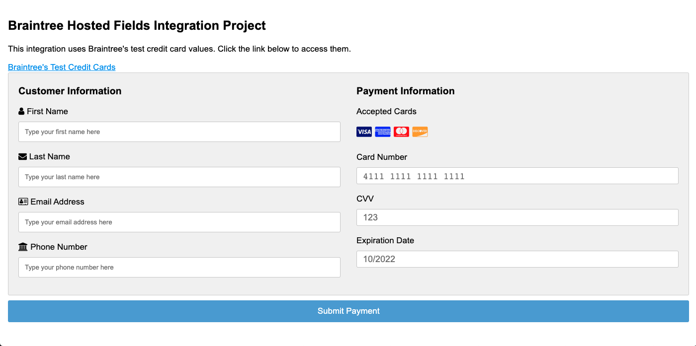
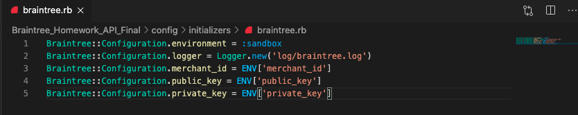
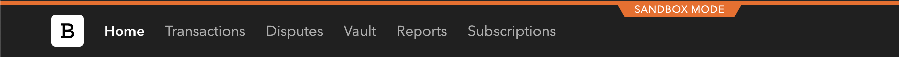
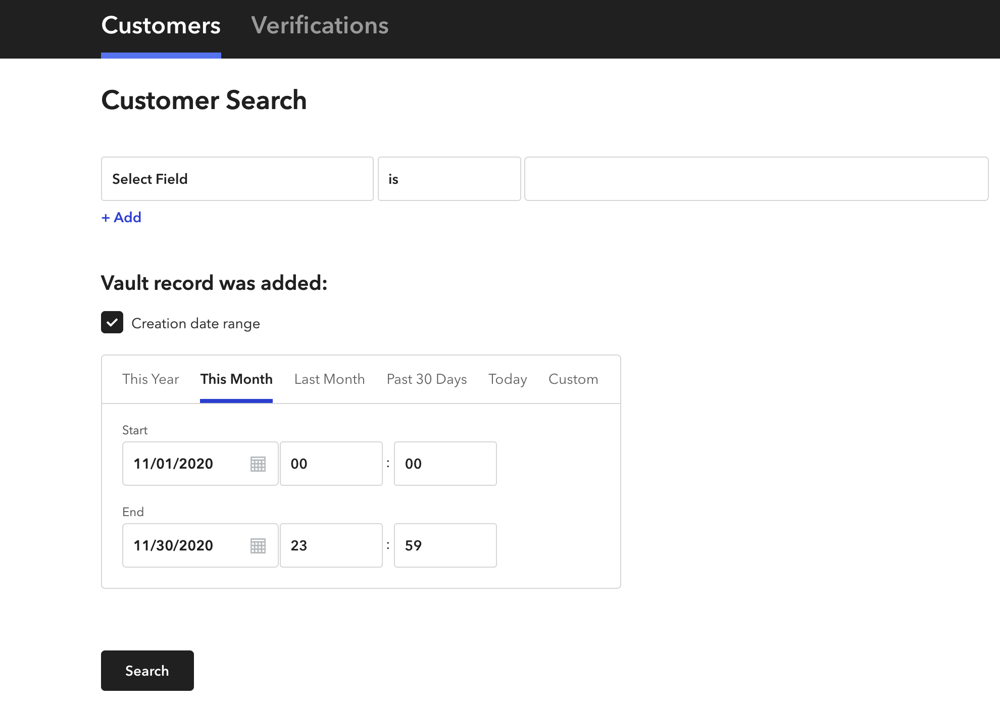
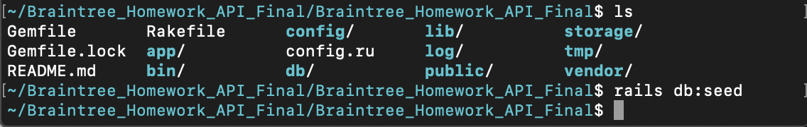

# API Support Internal Code Challenge (11/2020)

The Branitree Hosted Fields Integration outlined throughout this documentation is my candidate take home assignment for Braintree's API Support team. It is two-parts with the first being a general Hosted Fields Integration built alongside instructions (included) from the hiring team. The second is a PostgreSQL database also built according to instructions (included) provided by the hiring team. 

## Achitecture
---
#### Technical Stack/Framework Used
* [Fullstack Ruby on Rails](https://guides.rubyonrails.org/v5.0/getting_started.html) 
* [PostgreSQL (Database)](https://postgresapp.com/)
* [Braintree API](https://www.braintreepayments.com/sandbox)
  * Ruby SDK (Server-Side)
  * Javascript SDK (Client-Side)
#### Languages
* [Ruby](https://www.ruby-lang.org/en/documentation/installation/)
* [SQL](https://postgresapp.com/)
* Javascript
* HTML
* CSS

## API Reference Documentation
---
[Braintree's Set Up Your Server for Ruby SDK](https://developers.braintreepayments.com/start/hello-server/ruby)

[Braintree's Client SDK for JavaScript v3 SDK](https://developers.braintreepayments.com/guides/client-sdk/setup/javascript/v3)

[Braintree's Hosted Fields Setup and Integration](https://developers.braintreepayments.com/guides/hosted-fields/setup-and-integration/javascript/v3)

[Braintree's Hosted Fields Reference GitHub Documentation](https://braintree.github.io/braintree-web/current/HostedFields.html)

[Braintree's Transaction.sale() for Ruby SDK](https://developers.braintreepayments.com/reference/request/transaction/sale/ruby)

[Braintree's PaymentMethodNonce.create() for RubySDK](https://developers.braintreepayments.com/reference/request/payment-method-nonce/create/ruby)

[Braintree's Customer.create() for Ruby SDK](https://developers.braintreepayments.com/reference/request/customer/create/ruby)

---
 

## Project Setup
---
 
Note: It is important that you have the frameworks and languages associated with this project installed on your machine before proceeding. I have included links to each one under the **Architecture** heading to assist with this. 

0. If you haven't already, head over to Braintree and sign up for a [free sandbox account](https://www.braintreepayments.com/sandbox). After signing up, login and locate your important gateway credentials (review the Braintree support article entitled  [Important Gateway Credentials](https://articles.braintreepayments.com/control-panel/important-gateway-credentials) for assistance with this). Keep these values accessible throughout the  project setup and integration testing as they will be needed.
1. Save the project zip file to your machine and navigate to the project's directory within your terminal.
2. Once in the project's directory, run the command   
>`bundle install` 
3. After all of the ruby gem files have successfully loaded as indicated by your terminal, open the project within your text editor.
4. From your text editor locate the **braintree.rb** (config>initializers>braintree.rb) file within the project hiearchy and input the corresponding unique gateway credentials associated with your Braintree Sandbox as illustrated below. (see Step 0 for assistance with locating these values)

5. Return to the project's directory within your terminal and run the command   
>`rails server` 
6. The project should be loading on your localhost server as indicated by terminal activity and you should now be able to see the project in your browser as pictured above.

Happy Testing!

 

## Integration Project: Part 1
---

>Objective: 
>Your integration should make use of our ​JavaScript v3 SDK Hosted Fields​ solution and any of our server-side languages available on our ​API documentation page​. Hosted Fields is a little different than the Drop-In UI solution described in the ​Getting Started guide​, but many of the basic concepts are the same. 

>Your client-side code needs to:
>1. Request a from your server
>2. Perform a
request to configure Hosted Fields. You’ll
 ​client_token​
  ​braintree.hostedFields.create​
 need to use the client token
>3. Present a payment form​ that uses Hosted Fields
>4. Upon submission, your form should submit a ​payment method nonce​ to your server to
create a transaction
>5. Inform your end user of whether or not the transaction in step 4 was successful

>Your server-side code needs to:
>1. Generate a ​client_token​ in response to your client-side request
>2. Make an API request to use the ​payment_method_nonce​ to ​verify a card​ and ​store it in
your Vault
>3. Make a subsequent API request using the result object from Step 2 to ​create a
transaction​ using this stored payment method token

>Your integration should appropriately handle client-side and server-side errors and present the
>relevant information for any errors to your end users.

 

### Overview
---

This portion of the project requires no additional installtion steps. After following the steps listed in the project setup section, you should be able to perform tests via the application in your browser.  

### Testing
---
In order to test this integration against the various contraints listed above (or ones you come up with), it is recommended that you use [Braintree Sandbox's test credit card values](https://developers.braintreepayments.com/guides/credit-cards/testing-go-live/ruby) in creating transactions. You can create customers using any criteria as long as the following are provided:
* First Name
* Last Name
* Email 
* Phone Number (must be a numerical value)

Transactions can be searched within your Braintree Sandbox using the **Transactions** (shown below) button located in the top right corner of the Control Panel's navigation bar. Clicking this button will yield a search panel. This [search panel within the Control Panel](https://articles.braintreepayments.com/control-panel/search) allows you to query transactions and customers that you create from testing. 

You can also search customers and verifications in the same way using the **Vault** button also located on the Control Panel's navigation bar.

### Credits
---
[Reddit Article "How I got the Braintree Payments SDK to work...Posted byu/-Zhytomyr-3 years ago"](https://www.reddit.com/r/laravel/comments/5tk6g6/how_i_got_the_braintree_payments_sdk_to_work/) 

[Using Braintree hosted fields with Ruby on Rails](https://brobertsaz.github.io/2017/rails-with-braintree-hosted-fields/)

[Form Validations with HTML5 and modern Rails](https://www.jorgemanrubia.com/2019/02/16/form-validations-with-html5-and-modern-rails/)

 

## Integration Project: Part 2
---
>Objective: Option One 

>​The goal is to create a SQL database that will accept ​customer information and ​transaction information​. Please provide 2 recommendations for queries we can run to access the data.

>Instructions:
>1. Add a SQL database to your integration. As a note, your database does not need to be persistent. We will run transactions through your integration before accessing the database, that said if there are any specific steps you’d like us to take to seed the database, please do include instructions.
>2. Any transactions and customers created should be added to the database
>3. Include instructions for where queries can be made to access transaction and
customer information from the database      
>4. Include 2 SQL queries that can be run to access specific data within the database

### Overview 
---
This integration is designed to store the transaction and customer information created during part one testing within a PostgreSQL database. I provide steps on seeding the database in addition to executable queries using your terminal or pgAdmin, a database visualization tool, below. 
 
### Schema
---
**_Customers_**
| first_name      | last_name | email             | phone            |
| ----------- | ----------- | ----------- | ----------- |
| Header      | Title       |             |             |
| Paragraph   | Text        |             |             |
 

**_Transactions_**
| braintree_id      | amount | status             | customer_id            |
| ----------- | ----------- | ----------- | ----------- |
| Header      | Title       |             |             |
| Paragraph   | Text        |             |             |

 

### Seeding the Database
--- 

While the testing completed in part one results in customer and transaction information being stored in this database, you are not expected to seed the database from testing alone. I have included a file, **seeds.rb** (db>seeds.rb), that should be used instead to seed the database.

0. Navigate to the project directory within your terminal.
1. Once inside the directory run the command 
>`rails db:seed`
2. Rails is not expressive after this command. It simply moves the cursor in preparation for another command. This means we're ready to query the database. 

 

### Installation
---
For macOS users, I recommend obtaining Postgres.app, an open source macOS application that includes PostgreSQL as well as the PostGIS extension and a few other goodies:

1. Visit http://postgresapp.com/ and download the app's Disk Image file that ends in .dmg.
2. Double-click the .dmg file to open it, and then drag and drop the app icon into your _applications_ folder.
3. Double-click the app icon. When Postgres.app opens, click **Initializers** to create and start a PostgreSQL database.

A small elephant icon in your menu bar indicates that you now have a databse running. To use included PostgreSQL command line tools, you'll need to open your Terminal application and run the following code at the prompt.

>`sudo mkdir -p /etc/paths.d &&`
 

>`echo /Applications/Postgres.app/Contents/Versions/latest/bin | sudo tee /etc/paths.d/postgressapp`

If you plan to query the databse using your terminal feel free to move on to the _Queries + Testing_ section using the terminal instructions.

0. Visit the pgAdmin site's page for macOS downloads at _https://www.pgadmin.org/download/pgadmin-4-macos/.
1. Select the latest version and download the installer (look for a Disk Image file that ends in .dmg).
2. Double-click the .dmg file, click through the prompt to accept the terms, and then drag pgAdmin's elepgant app icon into your _Applications_ folder. 
3. Double-click the app icon to launch pgAdmin.

_On macOS, when you launch pgAdmin the first time, a dialog might appear that displays "pgAdmin4.app can't be opened because it is from an unidentified developer." Right-click the icon and select **Open**. The next dialog should give you the option to open the app; going forward, your Mac will remember you've granted this permission._

Installation on macOS is relatively simple, but if you encounter any issues, review the documentation for Postgres.app at _https://postgresapp.com/_ and for pgAdmin at _https://wwww.pgadmin.org/docs/_. 

 

### Queries + Testing
___

 

#### Terminal
---
 

#### pgAdmin
---

1. 

 

### Credits
---
DeBarros, A. "Chapter 4: Importing and Exporting Data." *Practical SQL: A Beginner's Guide to Storytelling With Data,* Edited by No Startch Press. San Francisco. 2018, pp.24-37.   

DeBarros, A. "Chapter 6: Joining Tables in a Relational Database." *Practical SQL: A Beginner's Guide to Storytelling With Data,* Edited by No Startch Press. San Francisco. 2018, pp.73-91.   

DeBarros, A. "Chapter 7: Table Design that Works for You." *Practical SQL: A Beginner's Guide to Storytelling With Data,* Edited by No Startch Press. San Francisco. 2018, pp.93-112.   

